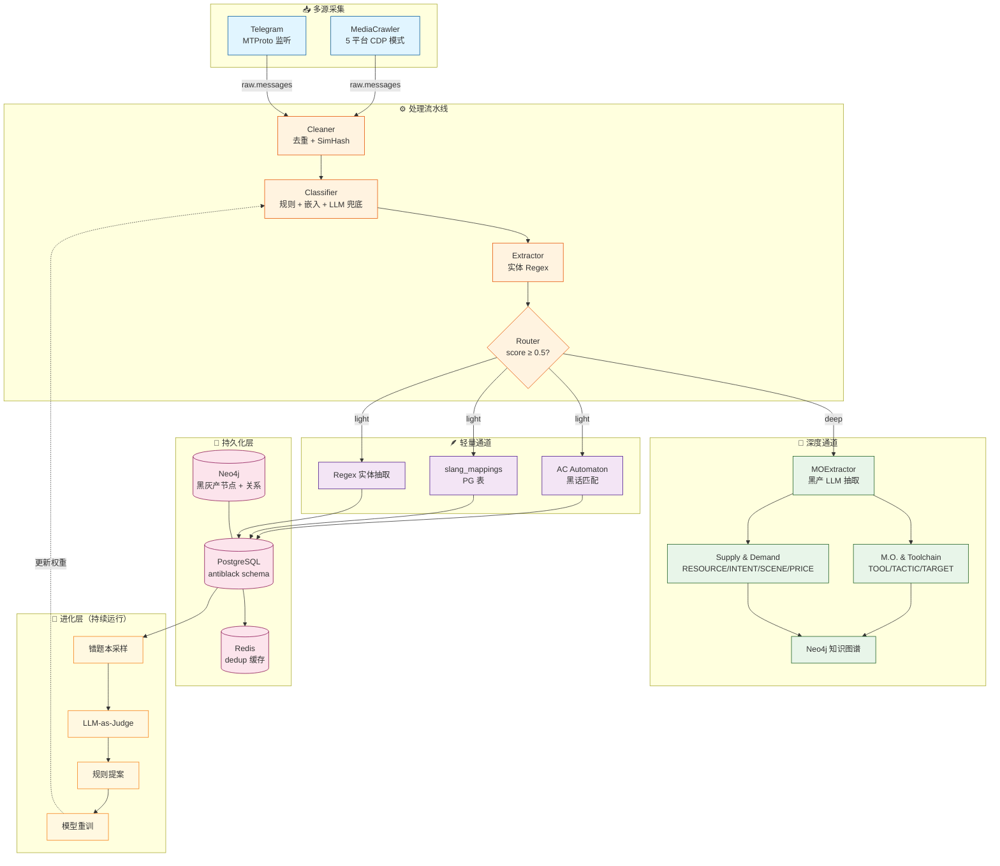

# AntiBlack · 黑灰产情报分析系统

[](https://www.python.org/)
[](https://fastapi.tiangolo.com/)
[](https://www.postgresql.org/)
[](https://neo4j.com/)
[](#许可证)

> 字节系黑产情报采集 + LLM 驱动分类 + 黑灰产知识图谱 的端到端系统

---

## 项目简介

**AntiBlack** 是一个针对字节系生态（抖音 / 小红书 / 头条 / 西瓜等）黑灰产信号的**采集、识别、关联、研判**一体化平台。系统通过 MediaCrawler 多平台采集公开内容，结合规则引擎 + 机器学习 + LLM 完成风险分类、实体抽取、产业链关联，最终沉淀为可查询的黑灰产知识图谱。

**当前已验证可采集平台**（CDP 模式）：

| 平台 | 数据量（示例） | 说明 |
|------|---------------|------|
| 抖音 (douyin) | 143 aweme + 1611 comment | ✅ CDP 模式成功 |
| 百度贴吧 (tieba) | 102 note + 905 comment | ✅ CDP 模式成功 |
| 快手 (kuaishou) | 32 video | ⚠️ 平台关键词返回少，非代码问题 |
| 微博 (weibo) | 237 note + 1170 comment | ✅ 成功 |
| 小红书 (xhs) | 197 note + 1586 comment | ✅ 需定期更新 Cookie |

## 核心特性

- 🔌 **多源采集**：MediaCrawler 多平台（dy/tieba/xhs/ks/wb）+ Telegram MTProto 监听
- 🧠 **三级分类漏斗**：规则匹配 → 嵌入相似度 → LLM 兜底（按需路由）
- 📚 **黑话自学习**：状态机 NEW→OBSERVED→LIKELY→CONFIRMED→STABLE，独立样本原则 + LLM 三重验证 + 60% 真实 backtest
- 🕸️ **黑灰产知识图谱**：基于 LightRAG 的 M.O. & Toolchain 图谱 + Supply & Demand 图谱（详见 [docs/MO图谱设计.md](docs/MO图谱设计.md)）
- 🔁 **自动进化**：错题本（LLM-as-Judge）→ 候选规则提案 → 人工审批
- 🛡️ **24/7 守护进程**：常驻后台轮询、定时任务、Token 预算控制、降级模式
- 📊 **可视化看板**：Vue 3 SPA（Element Plus + Pinia）+ ECharts

## 架构总览



完整架构详见 [docs/架构设计.md](docs/架构设计.md)。

## 目录结构

```
antiblack/
├── api/                         # FastAPI 应用
│   ├── __init__.py              # FastAPI app factory
│   ├── deps.py                  # 依赖注入 (数据库)
│   ├── routes/                  # 路由: queries / clues / entities / ...
│   └── schemas/                 # Pydantic 模型
│
├── config/                      # 配置加载
│   └── __init__.py              # config.yaml + .env 单例
│
├── models/                      # 数据模型
│   ├── domain/                  # 领域实体 (Entity, SlangMapping, ...)
│   ├── clients/                 # 外部客户端
│   └── ml/                      # 机器学习模型
│
├── pipeline/                    # 处理流水线
│   ├── cleaner.py               # 数据清洗
│   ├── classifier.py            # 风险分类
│   ├── extractor.py             # 实体抽取 (Regex)
│   ├── router.py                # 分流决策
│   ├── slang_learning.py        # 黑话自学习 (LLM 验证)
│   ├── mo_extractor.py          # M.O. & Supply/Demand 抽取 (LLM)
│   └── media_crawler_adapter.py # MediaCrawler 适配器
│
├── services/                    # 服务层
│   ├── database.py              # PostgreSQL 服务
│   ├── daemon_scheduler.py      # 24/7 守护进程调度
│   ├── lightrag_service.py      # LightRAG 集成
│   ├── kafka_service.py         # Kafka 生产/消费
│   ├── orchestrator.py          # LLM Tool 编排
│   ├── error_book_sampler.py    # 错题本抽检
│   ├── model_retrainer.py       # 模型重训触发
│   └── ac_automaton_service.py  # AC 自动机
│
├── scripts/                     # 运维脚本
│   ├── start_all.ps1            # 一键启动所有服务 (Windows)
│   ├── start_api.py             # 启动 API 服务
│   ├── run_daemon.py            # 启动守护进程
│   ├── media_crawler_publisher.py  # 爬虫推流到 Kafka
│   ├── multi_crawler_scheduler.py # 多平台调度
│   └── ...
│
├── frontend/                    # Vue 3 SPA (Element Plus + Pinia)
│
├── tests/                       # 单元测试 (pytest)
│
├── MediaCrawler/                # 数据采集 (已定制子模块)
├── LightRAG/                    # 知识图谱 (子模块)
│
├── docs/                        # 设计文档
│   ├── 架构设计.md
│   ├── 需求设计.md
│   ├── 数据处理.md
│   ├── 接口文档.md
│   ├── MO图谱设计.md
│   └── ...
│
├── config.yaml                  # 主配置
├── requirements.txt             # 依赖
├── CLAUDE.md                    # Claude Code 协作说明
└── README.md
```

## 快速开始

### 1. 环境要求

- Python 3.10+
- Conda 环境（推荐 `anti-black`）
- Docker / Docker Compose（基础设施）
- Windows 10/11 或 Linux

### 2. 启动基础设施

基础设施在远程 VM `192.168.148.128` 上，包括 PostgreSQL / Kafka / Neo4j / Redis。

```bash
cd docker-deploy
./start.sh    # 或 docker compose up -d
```

### 3. 安装依赖

```bash
conda create -n anti-black python=3.10 -y
conda activate anti-black
pip install -r requirements.txt
```

### 4. 配置

```bash
# 复制环境变量模板
cp .env.example .env
# 编辑 .env 填入 API 密钥 + 数据库连接
```

关键配置项（`config.yaml`）：

| 配置块 | 说明 |
|--------|------|
| `mongodb` / `kafka` | 中间件连接 |
| `cloud_vlm` / `ollama` | VLM / Embedding 服务 |
| `lightrag.llm` / `lightrag.llm_backup` | LLM 端点（主 + 备） |
| `lightrag.neo4j` / `lightrag.postgresql` | 图谱 + 向量库 |
| `media_crawler.platforms` | 启用哪些平台 + 关键词 |
| `slang_learning.thresholds` | 黑话学习阈值 |

### 5. 启动 API 服务

```bash
conda run -n anti-black python -m uvicorn api:app --reload --port 8000
```

- API 服务: <http://127.0.0.1:8000>
- OpenAPI 文档: <http://127.0.0.1:8000/docs>

### 6. 一键启动所有微服务（Windows）

```powershell
.\scripts\start_all.ps1
```

将弹出 5 个独立控制台窗口（API / 爬虫底层 / 调度器 / 推流端 / 处理大脑）。

### 7. 测试

```bash
# 全部测试
pytest tests/ -v

# 单个测试
pytest tests/test_classifier.py -v
```

## 核心模块

### 处理流水线

| 模块 | 文件 | 职责 |
|------|------|------|
| Cleaner | `pipeline/cleaner.py` | 去重 + SimHash + 噪音过滤 |
| Classifier | `pipeline/classifier.py` | 风险分类（规则 + 嵌入 + LLM 兜底） |
| Extractor | `pipeline/extractor.py` | 实体抽取（Regex：微信号/手机/QQ/URL/邮箱） |
| Router | `pipeline/router.py` | 多维评分 → 轻/深通道分流 |
| SlangLearner | `pipeline/slang_learning.py` | 黑话自学习状态机 |
| MOExtractor | `pipeline/mo_extractor.py` | LLM 驱动的黑灰产节点抽取 |

### 服务层

| 服务 | 文件 | 职责 |
|------|------|------|
| PostgreSQL | `services/database.py` | 主数据库（antiblack schema） |
| LightRAG | `services/lightrag_service.py` | Neo4j + PGVector 知识图谱 |
| Kafka | `services/kafka_service.py` | 消息队列 |
| DaemonScheduler | `services/daemon_scheduler.py` | 24/7 守护进程调度 |
| Orchestrator | `services/orchestrator.py` | LLM Tool 编排（多步推理） |

详细说明见各模块 docstring。

## 知识图谱

系统维护**两个核心图谱**：

### 1. M.O. & Toolchain（作案手法与工具链）

节点：`TOOL`（黑产工具）/ `TACTIC`（战术动作）/ `TARGET`（攻击目标）
关系：`enables` / `targets` / `alternative_to`

**业务价值**：
- 自动化威胁情报：新黑产工具出现时自动关联现有手法
- 攻击预测：某工具频繁与某场景共现时提前拦截

### 2. Supply & Demand（产业链供需流转）

节点：`RESOURCE`（黑产资源）/ `INTENT`（交易意图）/ `SCENE`（应用场景）/ `PRICE`（价格）
关系：`supplies` / `demands` / `priced_at`

**业务价值**：
- 锁定核心供应链：识别当前最稀缺资源 → 推断风控策略生效方向
- 上下游溯源：找出"提供虚假资质"→"做虚假短视频带货"的物料链路

详见 [docs/MO图谱设计.md](docs/MO图谱设计.md)。

## 配置说明

### 关键阈值（`config.yaml`）

```yaml
slang_learning:
  thresholds:
    new_to_observed: 10
    observed_to_likely: 20
    likely_to_confirmed: 50    # 候选词 50 次独立上下文才进 LLM 校验
    stable_count: 500

pipeline:
  routing:
    default_threshold: 0.6
    token_adjusted_threshold: 0.7
```

### 环境变量（`.env`）

| 变量 | 用途 |
|------|------|
| `DB_HOST` / `POSTGRES_HOST` | PostgreSQL 主机 |
| `KAFKA_BOOTSTRAP_SERVERS` | Kafka 集群 |
| `NEO4J_URI` / `NEO4J_USERNAME` / `NEO4J_PASSWORD` | Neo4j 认证 |
| `OPENAI_API_KEY` | MiniMax LLM 密钥（OpenAI 兼容） |
| `DASHSCOPE_API_KEY` | 阿里百炼 VLM |
| `VLM_API_BASE` / `VLM_MODEL` | VLM 端点 |
| `TELEGRAM_API_ID` / `TELEGRAM_API_HASH` / `TELEGRAM_PHONE` | Telegram 凭据 |

完整配置说明见 `config.yaml` 注释。

## API 速查

完整 API 文档：<http://127.0.0.1:8000/docs>（FastAPI 自动生成）。

| 端点 | 方法 | 用途 |
|------|------|------|
| `/api/v1/queries` | POST | 发起自然语言查询 |
| `/api/v1/queries/{id}/stream` | GET (SSE) | 实时进度流 |
| `/api/v1/clues` | GET | 线索列表 |
| `/api/v1/clues/{id}` | GET | 线索详情 |
| `/api/v1/entities/{id}/profile` | GET | 实体画像 |
| `/api/v1/feedback` | POST | 纠错反馈 |
| `/api/v1/system/pipeline-status` | GET | 后台巡逻状态 |
| `/api/v1/taxonomy` | GET | 风险分类体系 |
| `/api/v1/seed-words` | GET | 种子词库状态 |
| `/api/v1/seed-words/{word}/promote` | POST | 手动晋升种子词 |
| `/api/v1/evolution/proposals` | GET | 规则提案列表 |
| `/api/v1/evolution/proposals/{id}/approve` | POST | 审批规则提案 |
| `/api/v1/exports` | POST | 创建导出任务 |
| `/api/v1/metrics/overview` | GET | 监控概览 |
| `/api/v1/channels/{platform}/status` | GET | 渠道状态 |
| `/api/v1/channels/{platform}/config` | POST | 配置渠道采集 |

## 部署

### 生产部署清单

- [ ] PostgreSQL / Neo4j / Redis / Kafka 在远程 VM 运行（`192.168.148.128`）
- [ ] `.env` 填入所有 API 密钥
- [ ] `config.yaml` 的 `media_crawler.platforms` 启用目标平台
- [ ] CDP 模式：手动启动 `chrome --remote-debugging-port=1936`
- [ ] Redis 持久化配置（dedup 缓存）
- [ ] Prometheus 指标导出（`monitoring.metrics`）
- [ ] 日志轮转（`logging` 块配置）

### Windows 后台运行

```powershell
# 注册为 Windows 服务（使用 nssm）
nssm install AntiBlackAPI "C:\path\to\conda.exe" "run -n anti-black python -m uvicorn api:app --host 0.0.0.0 --port 8000"
nssm install AntiBlackDaemon "C:\path\to\conda.exe" "run -n anti-black python scripts/run_daemon.py"
```

## 开发指南

### 测试

```bash
# 全部单元测试
pytest tests/ -v -k "not _e2e"

# 跳过 e2e 测试（仅本地无外部依赖）
pytest tests/ -v -m "not e2e"
```

### 代码风格

- Python 3.10+ 类型注解
- Dataclass 优先于 dict
- 日志使用 `logger = logging.getLogger(__name__)`
- 数据库事务封装在 `services/database.py` 方法内
- 异步优先（`async def` + `await`）

### 调试经验

详见 [CLAUDE.md](CLAUDE.md) 的「调试经验总结」段落，包含：
- MediaCrawler 数据库配置注意
- 各平台 CDP 模式成功率
- 已知 Bug 修复记录

## 文档索引

| 文档 | 内容 |
|------|------|
| [docs/架构设计.md](docs/架构设计.md) | 系统架构详解（55K 字） |
| [docs/需求设计.md](docs/需求设计.md) | 需求规格（39K 字，含 FR-SLANG-01~07） |
| [docs/数据处理.md](docs/数据处理.md) | 数据流设计 |
| [docs/接口文档.md](docs/接口文档.md) | API 接口文档（45K 字） |
| [docs/MO图谱设计.md](docs/MO图谱设计.md) | 黑灰产 M.O. & Supply/Demand 图谱设计 |
| [docs/全天候自动化守护进程规划.md](docs/全天候自动化守护进程规划.md) | 24/7 守护进程规划 |
| [docs/新黑产类别自动发现规划.md](docs/新黑产类别自动发现规划.md) | 自动发现新黑产类别 |
| [docs/环境搭建指南.md](docs/环境搭建指南.md) | 环境搭建详细步骤 |
| [CLAUDE.md](CLAUDE.md) | Claude Code 协作说明（含调试经验） |

## 贡献指南

欢迎提交 Issue / PR。在贡献前请阅读：

1. [CLAUDE.md](CLAUDE.md) 了解项目约定
2. 运行 `pytest tests/ -v` 确保现有测试通过
3. 新增功能需配套单元测试
4. 提交前确认无 LLM API 密钥泄露（`.env` 不入版本控制）

## 许可证

本项目为 **proprietary** 软件，仅供内部使用。

本项目包含 [MediaCrawler](https://github.com/NanmiCoder/MediaCrawler) 子目录，其代码遵循 [NON-COMMERCIAL LEARNING LICENSE](MediaCrawler/LICENSE)。请在使用时遵守其许可证条款。

本项目包含 [LightRAG](https://github.com/HKUDS/LightRAG) 子模块，其代码遵循 MIT 许可证。

## 致谢

- [MediaCrawler](https://github.com/NanmiCoder/MediaCrawler) — 多平台数据采集
- [LightRAG](https://github.com/HKUDS/LightRAG) — 知识图谱构建
- [FastAPI](https://fastapi.tiangolo.com/) — Web 框架
- [Vue 3](https://vuejs.org/) + [Element Plus](https://element-plus.org/) — 前端框架

---

**维护者**：AntiBlack Team
**最后更新**：2026-06-03
