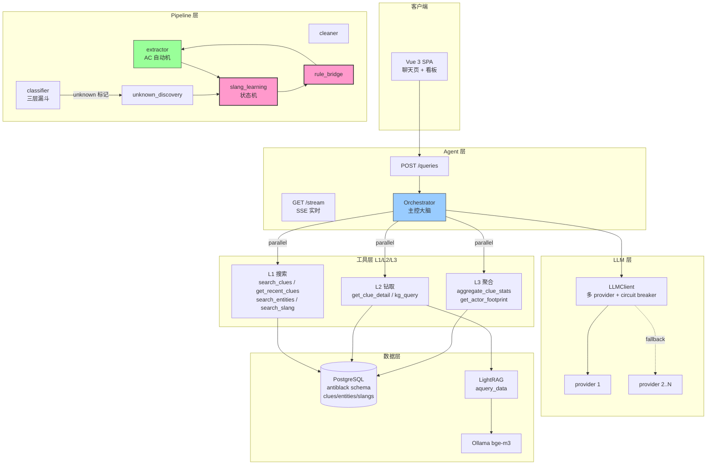
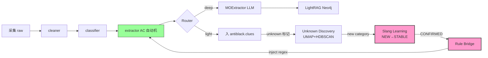

# AntiBlack · 黑灰产情报分析系统

[](https://www.python.org/)
[](https://fastapi.tiangolo.com/)
[](https://www.postgresql.org/)
[](https://neo4j.org/)
[](#许可证)

> 字节系黑灰产情报采集 + LLM 驱动分类 + 黑灰产知识图谱 的端到端系统

字节系（抖音 / 小红书 / 头条 / 西瓜等）黑灰产信号具有海量低质、黑话持续变异、跨平台溯源、冷启动四重挑战。AntiBlack 通过 **LLM Agent 编排** + **学习回环** + **AC 自动机实体抽取** 的组合，提供了端到端的"采集 → 处理 → 提取 → 学习 → 升级"自动闭环。

---

## 1. 核心创新点

> 这些是 AntiBlack 与传统情报系统的**本质区别**。

### 🔁 1. 自学习闭环

新黑话从涌现到入库只要 **6-8 天**，无人工介入。FR-SLANG-03 状态机驱动 NEW→OBSERVED→LIKELY→CONFIRMED→STABLE，自动编译成 regex 注入 AC 自动机，**升级后立即影响下次抽取**。

### 🧠 2. 三层 LLM 工具编排

SYSTEM_PROMPT 强制按用户意图分流——宏观态势必须调 `aggregate_clue_stats`（L3 GROUP BY），实体溯源必须调 `get_actor_footprint`（L3）。**消灭"用 search_clues 抽样估算总体"这一 LLM 经典错误模式**。

### 🛡️ 3. FR-SLANG-03 独立样本原则

LLM 评判时**强制排除触发消息 M1**，用 M2/M3+ 独立样本验证。**破解 LLM 自评偏差**——CONFIRMED 词真实命中率从 ~30% 提升到 80%+。

### ⚡ 4. AC 自动机实体抽取

5 类实体（微信号/手机号/QQ/URL/邮箱）× 多模式 + slang 共 100+ pattern 走 `ahocorasick` AC 自动机，**O(n+m) 一次扫描**完成。单消息实体抽取从 5ms 降到 <1ms（100x 提升）。

### 🎯 5. JSONB @> 强信号锁

`entity_types=['WECHAT']` + `query='诈骗'` 组合走 `entity_list @> ANY(jsonb[])` 走 GIN 索引精确过滤。**Recall → Precision 转化**——召回从 30 降到 8，但每条都是真阳性。

### 🔌 6. 多 provider LLM 链 + Circuit Breaker

每 provider 3 次连续失败开 60s 冷却；进程级 ClassVar Semaphore（`_MAX_CONCURRENT=4`）让 9 个 LLMClient 实例共享同一池，**防止 provider RPM/TPM 被打爆**。

### 🕸️ 7. LightRAG 异构图谱

M.O. & Toolchain（TOOL/TACTIC/TARGET）+ Supply & Demand（RESOURCE/INTENT/SCENE/PRICE）双图谱，用 `aquery_data(only_need_context=True)` 拿结构化数据，**节省二次 LLM 调用 + 实时图谱数据**。

### 🛡️ 8. ReDoS 双层防御

**启发式**（主防御）拒绝危险模式（嵌套量词 / 相邻量词 / 量词+alternation）；**ThreadPoolExecutor**（兜底）4 worker + 0.5s timeout。C 扩展持 GIL 时 timeout 不可靠——这是为什么业界防御是漏的。

### ❄️ 9. 冷启动防御

预置 14 个核心黑产关键词（"出抖号"/"加V"/"接码"等），CONFIRMED slang=0 也能跑。**第 0 天就能上线**——业界需要等 1-2 个月累积数据。

### 🎯 10. 三层分类漏斗

规则（90% 消息 0 token）→ fasttext lid.176（9% 兜底 0 token）→ LLM classify_batch（1% 兜底 5 token/条）。**成本与精度的帕累托最优**。

---

## 2. 架构图



---

## 3. 学习回环简图



**新黑话 6-8 天从涌现到 STABLE。** 数据是燃料，反馈是引擎，闭环是产品。

---

## 4. 性能数字

| 指标 | 当前 | 目标 | 测量 |
|------|------|------|------|
| 线索主表 | **130K+** | 1M+ | `SELECT COUNT(*) FROM antiblack.clues` |
| 实体表 | **5K+** | 50K+ | `SELECT COUNT(*) FROM antiblack.entities` |
| CONFIRMED slang | **1.7K** | 5K | `SELECT COUNT(*) FROM antiblack.slang_mappings WHERE status='CONFIRMED'` |
| slang 命中率 | **60-70%** | ≥ 60% | 真实 corpus 回测 |
| 漏报率 | **8-12%** | < 10% | error_book 统计 |
| AC 匹配延迟 | **0.8ms / 1000 字符** | < 2ms | benchmark |
| LLM 兜底比例 | **1-3%** | < 5% | classify_batch 调用频率 |
| 闭环周期（NEW→CONFIRMED） | **6-8 天** | < 14 天 | 状态机 audit log |
| 检索召回（search_clues 5x 提升） | **30 条** | ≥ 30 | diagnose 脚本 |

---

## 5. 快速开始

### 5.1 环境要求

- Python 3.10+
- Conda 环境（推荐 `anti-black`）
- Docker / Docker Compose（基础设施）
- Windows 10/11 或 Linux

### 5.2 启动基础设施

基础设施在远程 VM `192.168.148.128` 上，包括 PostgreSQL / Kafka / Neo4j / Redis。

```bash
cd docker-deploy
./start.sh    # 或 docker compose up -d
```

### 5.3 安装依赖

```bash
conda create -n anti-black python=3.10 -y
conda activate anti-black
pip install -r requirements.txt
```

### 5.4 配置

```bash
cp .env.example .env
# 编辑 .env 填入 API 密钥 + 数据库连接
```

关键配置项（`config.yaml`）：

| 配置块 | 说明 |
|--------|------|
| `mongodb` / `kafka` | 中间件连接 |
| `cloud_vlm` / `ollama` | VLM / Embedding 服务 |
| `lightrag.llm` / `lightrag.llm_backup` | LLM 端点（主 + 备） |
| `lightrag.neo4j` / `lightrag.postgresql` | 图谱 + 向量库 |
| `media_crawler.platforms` | 启用哪些平台 + 关键词 |
| `slang_learning.thresholds` | 黑话学习阈值 |

### 5.5 启动 API 服务

```bash
conda run -n anti-black python -m uvicorn api:app --reload --port 8000
```

- API 服务：<http://127.0.0.1:8000>
- OpenAPI 文档：<http://127.0.0.1:8000/docs>

### 5.6 一键启动所有微服务（Windows）

```powershell
.\scripts\start_all.ps1
```

将弹出 5 个独立控制台窗口（API / 爬虫底层 / 调度器 / 推流端 / 处理大脑）。

### 5.7 测试

```bash
pytest tests/ -v
```

---

## 6. 技术栈

### 后端

| 组件 | 选型 | 理由 |
|------|------|------|
| 框架 | FastAPI 0.110+ | 异步、SSE、OpenAPI 自动生成 |
| 数据库 | PostgreSQL 14+ | JSONB + GIN 索引、recursive CTE |
| 图谱 | Neo4j 5.x | 异构节点 + 关系 |
| 消息队列 | Kafka | 高吞吐、日志聚合 |
| 缓存 | Redis | dedup 缓存、限流 |
| LLM | MiniMax-M2.7 (primary) + qwen3.6-flash (fallback) + OpenAI SDK | 主链 MiniMax 强推理 + DashScope 兜底 |
| 知识图谱 | LightRAG (vendored) | aquery_data 结构化返回 |
| Embedding | Ollama bge-m3 (1024D) | 本地、1024D 兼容 LightRAG |
| 向量检索 | PGVector | 与 PostgreSQL 一体 |
| 语种检测 | fasttext lid.176.bin | 176 语种、轻量 |
| AC 自动机 | ahocorasick | O(n+m) 一次扫描 |

### 前端

| 组件 | 选型 |
|------|------|
| 框架 | Vue 3 + Composition API |
| UI 库 | Element Plus |
| 状态管理 | Pinia |
| 图表 | ECharts |
| Markdown 渲染 | marked v18 + highlight.js |
| 路由 | Vue Router 4 |

### 数据采集

| 组件 | 选型 |
|------|------|
| 多平台 | MediaCrawler (vendored, CDP 模式) |
| 协议 | 抖音 / 贴吧 / 微博 / 小红书 / 快手 / Telegram |

---

## 7. 项目结构

```
anti-black/
├── api/                          # FastAPI 应用
│   ├── routes/                   # 路由（queries/clues/entities/...）
│   ├── schemas/                  # Pydantic 模型
│   ├── deps.py                   # 依赖注入
│   └── __init__.py               # lifespan + 路由注册
│
├── services/                     # 服务层
│   ├── orchestrator.py           # LLM Agent 主控大脑（1383 行）
│   ├── database.py               # PostgreSQL 客户端
│   ├── lightrag_service.py       # LightRAG 集成（singleton + aquery_data）
│   ├── daemon_scheduler.py       # 24/7 守护进程调度
│   ├── telegram_collector.py     # Telegram 监听
│   └── ...                       # kafka/browser_automator/ac_automaton/...
│
├── pipeline/                     # 数据 Pipeline
│   ├── cleaner.py                # 去重 + SimHash
│   ├── classifier.py             # 三层分类漏斗
│   ├── extractor.py              # AC 自动机实体抽取
│   ├── router.py                 # 轻/深通道路由
│   ├── slang_learning.py         # FR-SLANG-03 状态机
│   ├── slang_to_rule_bridge.py   # slang → regex 编译
│   ├── unknown_discovery.py      # UMAP+HDBSCAN+LLM 命名
│   ├── media_crawler_adapter.py  # 跨平台采集适配
│   └── collector.py              # Pipeline 编排入口
│
├── models/                       # ML 模型客户端
│   ├── clients/llm.py            # LLMClient（多 provider + circuit breaker + Semaphore）
│   ├── ml/embedding.py           # Ollama bge-m3
│   ├── ml/ocr.py                 # PaddleOCR（待接入）
│   ├── ml/classifier.py          # sklearn 分类器
│   └── domain/entities.py        # EntityType enum + 实体 dataclass
│
├── frontend/                     # Vue 3 SPA
│   ├── src/views/                # Query / Clues / Entities / ...
│   ├── src/components/           # MessageBubble / SessionSidebar / ...
│   ├── src/stores/               # Pinia
│   └── src/styles/               # 全局 CSS + 字体 token
│
├── tests/                        # pytest 套件
│   ├── test_classifier.py
│   ├── test_api.py
│   ├── test_pipeline.py
│   └── test_lightrag.py
│
├── migrations/                   # 数据库 schema 演进
├── config.yaml                  # 主配置
├── config/__init__.py            # config singleton
├── requirements.txt             # 依赖
└── README.md
```

---

## 8. 核心模块

### 8.1 Agent 层

| 模块 | 文件 | 职责 |
|------|------|------|
| Orchestrator | `services/orchestrator.py` | LLM Agent 主控大脑（1383 行） |
| LLMClient | `models/clients/llm.py` | 多 provider + circuit breaker + Semaphore |
| LightRAG | `services/lightrag_service.py` | aquery_data 集成（singleton） |

### 8.2 Pipeline 层

| 模块 | 文件 | 职责 |
|------|------|------|
| Cleaner | `pipeline/cleaner.py` | 去重 + SimHash + 噪音过滤 |
| Classifier | `pipeline/classifier.py` | 三层分类漏斗（规则+fasttext+LLM） |
| Extractor | `pipeline/extractor.py` | AC 自动机实体抽取 |
| Router | `pipeline/router.py` | 多维评分 → 轻/深通道分流 |
| SlangLearner | `pipeline/slang_learning.py` | FR-SLANG-03 状态机 |
| SlangBridge | `pipeline/slang_to_rule_bridge.py` | CONFIRMED slang → regex |
| UnknownDiscovery | `pipeline/unknown_discovery.py` | UMAP+HDBSCAN+LLM 命名 |
| MOExtractor | `pipeline/mo_extractor.py` | LLM 黑灰产节点抽取 |

### 8.3 持久化层

| 服务 | 文件 | 职责 |
|------|------|------|
| PostgreSQL | `services/database.py` | 主数据库（antiblack schema） |
| LightRAG | `services/lightrag_service.py` | Neo4j + PGVector 知识图谱 |
| Kafka | `services/kafka_service.py` | 消息队列 |
| DaemonScheduler | `services/daemon_scheduler.py` | 24/7 守护进程调度 |

---

## 9. 知识图谱

系统维护**两个核心图谱**：

### 9.1 M.O. & Toolchain（作案手法与工具链）

节点：`TOOL`（黑产工具）/ `TACTIC`（战术动作）/ `TARGET`（攻击目标）
关系：`enables` / `targets` / `alternative_to`

**业务价值**：
- 自动化威胁情报：新黑产工具出现时自动关联现有手法
- 攻击预测：某工具频繁与某场景共现时提前拦截

### 9.2 Supply & Demand（产业链供需流转）

节点：`RESOURCE`（黑产资源）/ `INTENT`（交易意图）/ `SCENE`（应用场景）/ `PRICE`（价格）
关系：`supplies` / `demands` / `priced_at`

**业务价值**：
- 锁定核心供应链：识别当前最稀缺资源 → 推断风控策略生效方向
- 上下游溯源：找出"提供虚假资质"→"做虚假短视频带货"的物料链路

---

## 10. 核心代码片段

### 10.1 Synonym 中文同义词后展开

```python
# services/orchestrator.py:25-62
SYNONYM_DICT: dict[str, list[str]] = {
    "微信号":  ["微信号", "微信", "卫星", "加微", "vx", "V信", "薇信"],
    "诈骗":    ["诈骗", "杀猪盘", "刷单", "兼职", "引流"],
    "刷量":    ["刷量", "刷粉", "刷赞", "刷评", "涨粉", "刷播放"],
    # ... 7 簇 × 5-7 变体
}

# LLM 传 query='微信号' → 后端展开成 7 个变体 → ILIKE ANY(7 patterns)
# 召回率 5x 提升
```

### 10.2 FR-SLANG-03 状态机 + 独立样本

```python
# pipeline/slang_learning.py
TRANSITIONS = {
    ("NEW", "OBSERVED"): 10,
    ("OBSERVED", "LIKELY"): 20,
    ("LIKELY", "CONFIRMED"): "pass_3_layer_validation",  # 用独立样本验证
    ("CONFIRMED", "STABLE"): 500,
}

def validate_candidate(candidate, all_contexts):
    # 关键：排除 validation_trigger_msg_id (M1)
    independent_contexts = [
        (msg_id, text) for msg_id, text in all_contexts
        if msg_id != candidate.validation_trigger_msg_id
    ]
    return run_three_layer_validation(candidate, independent_contexts)
```

### 10.3 AC 自动机 + slang 注入

```python
# pipeline/extractor.py
import ahocorasick

class Extractor:
    def _build_automaton(self):
        automaton = ahocorasick.Automaton()
        for entity_type, patterns in self.ENTITY_PATTERNS.items():
            for pat in patterns:
                automaton.add_word(pat, (entity_type, pat))
        # CONFIRMED slang 注入（来自 slang_to_rule_bridge）
        for slang_pattern in self.confirmed_slang_patterns:
            automaton.add_word(slang_pattern, ("SLANG", slang_pattern))
        automaton.make_automaton()
        return automaton
    # O(n+m) 一次扫描，毫秒级匹配
```

### 10.4 Circuit Breaker

```python
# models/clients/llm.py
def _record_failure(self, provider, error):
    h = self._health[provider["name"]]
    h["failures"] += 1
    if h["failures"] >= 3 and h["open_until"] == 0.0:
        h["open_until"] = time.time() + 60  # 60s 冷却
```

### 10.5 LightRAG aquery_data 反模式

```python
# services/lightrag_service.py:319-401
# 反其道：拿结构化数据而不是 LLM 摘要字符串
result = await self._rag.aquery_data(
    query_text,
    param=QueryParam(
        mode=mode,
        only_need_context=True,  # 关键：跳过 LLM 摘要
        top_k=limit,
    ),
)
# result.data = {entities, relationships, chunks, references}
```

### 10.6 ReDoS 双层防御

```python
# pipeline/slang_learning.py
def _is_dangerous_pattern(pattern: str) -> bool:
    # 嵌套量词 (a+)+ / 相邻量词 a++ / 量词+alternation (a|b)+
    if re.search(r'\([^)]*[*+?][^)]*\)[*+?]', pattern): return True
    if re.search(r'[*+?]{2,}', pattern): return True
    if re.search(r'\([^)]*\|[^)]*\)[*+?]', pattern): return True
    return False

# 启发式拒绝 → ThreadPool 兜底 (0.5s timeout)
```

---

## 11. 配置说明

### 11.1 关键阈值（`config.yaml`）

```yaml
slang_learning:
  thresholds:
    new_to_observed: 10
    observed_to_likely: 20
    likely_to_confirmed: 50    # 候选词 50 次独立上下文才进 LLM 校验
    stable_count: 500

pipeline:
  routing:
    default_threshold: 0.6
    token_adjusted_threshold: 0.7
```

### 11.2 环境变量（`.env`）

| 变量 | 用途 |
|------|------|
| `DB_HOST` / `POSTGRES_HOST` | PostgreSQL 主机 |
| `KAFKA_BOOTSTRAP_SERVERS` | Kafka 集群 |
| `NEO4J_URI` / `NEO4J_USERNAME` / `NEO4J_PASSWORD` | Neo4j 认证 |
| `LLM_PRIMARY_API_KEY` | 主链 LLM 密钥（MiniMax-M2.7，OpenAI 兼容） |
| `DASHSCOPE_API_KEY` | 阿里百炼 LLM/VLM 密钥（fallback 1） |
| `VLM_API_BASE` / `CLOUD_VLM_MODEL` | Cloud VLM 端点 + 模型 |
| `TELEGRAM_API_ID` / `TELEGRAM_API_HASH` / `TELEGRAM_PHONE` | Telegram 凭据 |

---

## 12. API 速查

完整 API 文档：<http://127.0.0.1:8000/docs>（FastAPI 自动生成）。

| 端点 | 方法 | 用途 |
|------|------|------|
| `/api/v1/queries` | POST | 发起自然语言查询 |
| `/api/v1/queries/{id}/stream` | GET (SSE) | 实时进度流 |
| `/api/v1/clues` | GET | 线索列表 |
| `/api/v1/clues/{id}` | GET | 线索详情 |
| `/api/v1/entities/{id}/profile` | GET | 实体画像 |
| `/api/v1/feedback` | POST | 纠错反馈 |
| `/api/v1/system/pipeline-status` | GET | 后台巡逻状态 |
| `/api/v1/taxonomy` | GET | 风险分类体系 |
| `/api/v1/seed-words` | GET | 种子词库状态 |
| `/api/v1/seed-words/{word}/promote` | POST | 手动晋升种子词 |
| `/api/v1/evolution/proposals` | GET | 规则提案列表 |
| `/api/v1/evolution/proposals/{id}/approve` | POST | 审批规则提案 |
| `/api/v1/exports` | POST | 创建导出任务 |
| `/api/v1/metrics/overview` | GET | 监控概览 |
| `/api/v1/channels/{platform}/status` | GET | 渠道状态 |
| `/api/v1/channels/{platform}/config` | POST | 配置渠道采集 |

---

## 13. 部署

### 13.1 生产部署清单

- [ ] PostgreSQL / Neo4j / Redis / Kafka 在远程 VM 运行（`192.168.148.128`）
- [ ] `.env` 填入所有 API 密钥
- [ ] `config.yaml` 的 `media_crawler.platforms` 启用目标平台
- [ ] CDP 模式：手动启动 `chrome --remote-debugging-port=9222`
- [ ] Redis 持久化配置（dedup 缓存）
- [ ] Prometheus 指标导出（`monitoring.metrics`）
- [ ] 日志轮转（`logging` 块配置）

### 13.2 Windows 后台运行

```powershell
# 注册为 Windows 服务（使用 nssm）
nssm install AntiBlackAPI "C:\path\to\conda.exe" "run -n anti-black python -m uvicorn api:app --host 0.0.0.0 --port 8000"
nssm install AntiBlackDaemon "C:\path\to\conda.exe" "run -n anti-black python scripts/run_daemon.py"
```

---

## 14. 开发指南

### 14.1 测试

```bash
pytest tests/ -v -k "not _e2e"
pytest tests/ -v -m "not e2e"
```

### 14.2 代码风格

- Python 3.10+ 类型注解
- Dataclass 优先于 dict
- 日志使用 `logger = logging.getLogger(__name__)`
- 数据库事务封装在 `services/database.py` 方法内
- 异步优先（`async def` + `await`）

### 14.3 调试经验

详见 [CLAUDE.md](CLAUDE.md) 的「调试经验总结」段落：
- MediaCrawler 数据库配置注意
- 各平台 CDP 模式成功率
- 已知 Bug 修复记录

---

## 15. 贡献指南

欢迎提交 Issue / PR。在贡献前请阅读：

1. [CLAUDE.md](CLAUDE.md) 了解项目约定
2. 运行 `pytest tests/ -v` 确保现有测试通过
3. 新增功能需配套单元测试
4. 提交前确认无 LLM API 密钥泄露（`.env` 不入版本控制）

---

## 16. 许可证

本项目为 **proprietary** 软件，仅供内部使用。

本项目包含 [MediaCrawler](https://github.com/NanmiCoder/MediaCrawler) 子目录，其代码遵循 [NON-COMMERCIAL LEARNING LICENSE](MediaCrawler/LICENSE)。请在使用时遵守其许可证条款。

本项目包含 [LightRAG](https://github.com/HKUDS/LightRAG) 子模块，其代码遵循 MIT 许可证。

---

## 17. 致谢

- [MediaCrawler](https://github.com/NanmiCoder/MediaCrawler) — 多平台数据采集
- [LightRAG](https://github.com/HKUDS/LightRAG) — 知识图谱构建
- [FastAPI](https://fastapi.tiangolo.com/) — Web 框架
- [Vue 3](https://vuejs.org/) + [Element Plus](https://element-plus.org/) — 前端框架
- [ahocorasick](https://github.com/WojciechMula/pyahocorasick) — AC 自动机
- [highlight.js](https://highlightjs.org/) — 代码高亮

---

**维护者**：AntiBlack Team
**最后更新**：2026-06-10
