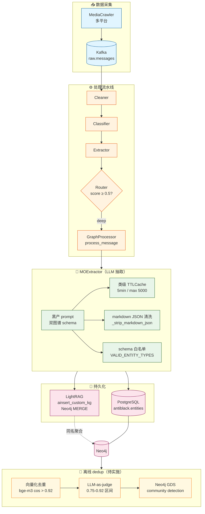

# 黑灰产 M.O. & Toolchain / Supply & Demand 图谱设计（2026-06-03）

> 状态：✅ 设计已落地（commit 待定）
> 所属模块：`pipeline/mo_extractor.py` + `services/lightrag_service.py:GraphProcessor`
> 关联需求：FR-EXT-DEEP-01/02 重构、FR-SLANG-06 重写

## 1. 背景与目标

### 1.1 旧实现的问题

| 维度 | 旧实现 | 问题 |
|------|--------|------|
| LightRAG 节点类型 | 1 类（slang 词典影子） | 与业务诉求"黑灰产产业链锁定"脱节 |
| 抽取方式 | LightRAG 默认 LLM 抽 person/org/location | 抽不出黑产工具/战术/资源/价格 |
| 跨消息聚合 | 无（slang 节点无共现） | 同账号/同工具无网络效应 |
| 写入实体类型 | `黑话 → 释义` 自包含字符串 | 4 行文本一个节点，无业务关系 |
| 维护成本 | 1 LLM call/词 + Neo4j 写 + 末位淘汰时双向清理 | 链路复杂，故障面大 |

### 1.2 新目标

让 LightRAG 成为**黑灰产图谱基础设施**——节点类型对齐业务诉求：

| 图谱 | 节点类型 | 关系类型 | 业务价值 |
|------|---------|---------|---------|
| **M.O. & Toolchain**（作案手法与工具链） | `TOOL` / `TACTIC` / `TARGET` | `enables` / `targets` / `alternative_to` | 自动化威胁情报、攻击预测 |
| **Supply & Demand**（产业链供需流转） | `RESOURCE` / `INTENT` / `SCENE` / `PRICE` | `supplies` / `demands` / `priced_at` | 锁定核心供应链、上下游溯源 |

## 2. 架构总览



## 3. 节点类型 Schema

### 3.1 M.O. & Toolchain

| 节点类型 | 释义 | 典型节点 |
|---------|------|---------|
| `TOOL` | 黑产工具（具体技术/平台/软件） | 接码平台, 改机工具, 群控系统, 云控脚本, 秒拼软件, 打码平台, 设备伪装, IP池, 指纹浏览器, 猫池, 多开工具, 模拟器, 注册机, 群发器 |
| `TACTIC` | 战术动作（具体行为/手法） | 养号, 截流, 爆粉, 刷屏, 刷粉, 刷赞, 刷量, 代实名, 代养, 解封, 搬号, 群控, 私信引流, 评论截流, 关注引流, 矩阵运营 |
| `TARGET` | 攻击目标（具体被攻击的产品/场景） | 抖音直播间, 本地生活评论区, 小店店铺, 短视频带货, 评论引流, 短视频评论区, 抖音粉丝群, 私信列表 |

### 3.2 Supply & Demand

| 节点类型 | 释义 | 典型节点 |
|---------|------|---------|
| `RESOURCE` | 黑产资源（可被交易的物料） | 千粉号, 万粉号, 实名号, 蓝V号, 企业号, 真人粉丝, 黑卡, IP池, 实名资料, 银行卡, 支付通道 |
| `INTENT` | 交易意图（买卖方向） | 出, 收, 寻, 代办, 出售, 求购, 回收, 出租, 转让, 换绑, 售卖 |
| `SCENE` | 应用场景（资源最终用途） | 无人直播, 短剧推广, 海外带货, 矩阵号运营, 截流变现, 带货口碑, 私域转化, 直播切片 |
| `PRICE` | 价格区间 | 100元, 1000元, 几十一百, 面议, 50-100元, 几百, 上千, 几万 |

### 3.3 关系类型

| 关系 | 含义 | 典型 |
|------|------|------|
| `enables` | 工具 → 用于 → 战术 | `云控脚本 enables 养号` |
| `targets` | 战术/工具 → 针对 → 目标 | `刷粉 targets 抖音直播间` |
| `alternative_to` | 工具 ↔ 工具（同类替代） | `猫池 alternative_to 接码平台` |
| `supplies` | 资源 → 供应 → 场景 | `千粉号 supplies 无人直播` |
| `demands` | 场景 → 需求 → 资源 | `无人直播 demands 千粉号` |
| `priced_at` | 资源 → 定价 → 价格 | `千粉号 priced_at 100元` |

## 4. 抽取流程

### 4.1 LLM Prompt（节选）

```text
你是黑灰产情报分析助手。请从以下黑产相关文本中提取结构化信息。

【图谱 1: 作案手法与工具链 (M.O. & Toolchain)】
- 黑产工具 (entity_type=TOOL)：接码平台, 改机工具, 群控系统, ...
- 战术动作 (entity_type=TACTIC)：养号, 截流, 爆粉, 刷屏, ...
- 攻击目标 (entity_type=TARGET)：抖音直播间, 本地生活评论区, ...

【图谱 2: 产业链供需 (Supply & Demand)】
- 黑产资源 (entity_type=RESOURCE)：千粉号, 万粉号, 实名号, ...
- 交易意图 (entity_type=INTENT)：出, 收, 寻, 代办, ...
- 应用场景 (entity_type=SCENE)：无人直播, 短剧推广, ...
- 价格 (entity_type=PRICE)：100元, 1000元, 面议, ...

【输出格式 (严格 JSON)】
{...}

原文: {text}
```

完整 prompt 见 `pipeline/mo_extractor.py:EXTRACTION_PROMPT`。

### 4.2 抽取器设计（MOExtractor）

```python
class MOExtractor:
    VALID_ENTITY_TYPES = frozenset({
        "TOOL", "TACTIC", "TARGET",
        "RESOURCE", "INTENT", "SCENE", "PRICE",
    })

    async def extract(self, text: str) -> Dict[str, Any]:
        """调 LLM 拿结构化 JSON,经类级 TTLCache 缓存,经 schema 校验。"""
        ...
```

**关键设计决策**：

1. **类级 TTLCache** 而非实例缓存：daemon 多 batch 各 new MOExtractor 时，类级缓存命中率 0 → 改为类变量。`cachetools.TTLCache(maxsize=5000, ttl=300)`（如未装则降级为带 TTL 的 dict）

2. **Markdown JSON 清洗**：Ollama 跑的开源模型（Qwen2.5/Mistral/Llama3）有 ~30% 概率在 JSON 外面套 ``` 标记，加 `_strip_markdown_json` 静态方法兜底

3. **Schema 白名单校验**：LLM 偶尔会输出 `ENTITY`/`THING` 等泛型，过滤掉非 `VALID_ENTITY_TYPES` 的 entity

4. **非静默降级**：`except Exception` 前 `logger.warning(f"raw_output: {raw[:200]}")`，监控能区分"LLM 抽风" vs "真没数据"

### 4.3 LightRAG 注入（`to_lightrag_kg`）

```python
def to_lightrag_kg(self, extraction, message_id) -> Dict[str, Any]:
    """把抽取结果转成 ainsert_custom_kg 接受的 DICT."""
    return {
        "chunks": [{
            "content": f"[M.O. extraction source: {message_id}]",
            "source_id": f"mo_msg_{message_id}",
        }],
        "entities": [
            {
                "entity_name": e["entity_name"],
                "entity_type": e["entity_type"],
                "description": e.get("description", ""),
                "source_id": f"mo_msg_{message_id}",
            }
            for e in extraction.get("entities", [])
        ],
        "relationships": [
            {
                "src_id": r["src_id"],
                "tgt_id": r["tgt_id"],
                "description": r.get("description", ""),
                "keywords": r.get("keywords", "related"),
                "weight": float(r.get("weight", 1.0) or 1.0),
                "source_id": f"mo_msg_{message_id}",
            }
            for r in extraction.get("relationships", [])
        ],
    }
```

**Neo4j MERGE 行为**（已读 `LightRAG/lightrag/kg/neo4j_impl.py:1038-1100` 验证）：
- `entity_name` 用作 Neo4j 主键 `entity_id`
- 同名 → 自动 MERGE → 跨消息聚合
- 同一 `TOOL:接码平台` 被多条消息提到，自动合并到单一节点
- `entity_type` 是 Neo4j 属性（非 label），`TOOL`/`TACTIC` 等任意字符串均可写

### 4.4 PG 持久化（`to_pg_entity_records`）

```python
def to_pg_entity_records(self, extraction, message_id, source_channel) -> List[Dict]:
    """转成 PG entities 表写入格式,供 services/database.py:upsert_entity() 调用。"""
    ...
```

写 `antiblack.entities` 表：
- `entity_type` ∈ {`TOOL`/`TACTIC`/`TARGET`/`RESOURCE`/`INTENT`/`SCENE`/`PRICE`}
- `raw_value` = 实体名（如"云控脚本"）
- `metadata` = `{description, source_message_id, ...}`
- 同一 `entity_id` 跨消息 → `ON CONFLICT DO UPDATE` 自增 `occurrence_count`

## 5. 与旧 slang→LightRAG 链路的关系

### 5.1 已废弃

| 旧逻辑 | 现状 |
|--------|------|
| `daemon_scheduler.py:_persist_confirmed_slang` 调 `insert_custom_kg` 写 slang | **已删**（line 329-343 整段移除） |
| `pipeline/slang_learning.py:eliminate_weak_slangs` 末尾 `delete_slang_entity` 清理 | **已删**（line 750-765 整段移除） |
| `lightrag_service.py:delete_slang_entity` 直接调 `adelete_entity_relation` | **修复**：只用公开 `adelete_by_entity`（内部已级联删关系） |

### 5.2 FR-SLANG-06 重写

旧 FR-SLANG-06 要求"CONFIRMED 状态的黑话写入 LightRAG 图谱"，实现方式为 4 行自包含文本的插入。**新 FR-SLANG-06**（建议在 `docs/需求设计.md` 中改写）：

> FR-SLANG-06 黑话主存：CONFIRMED 状态的黑话写入 PostgreSQL `slang_mappings` 表（已有 `regex_pattern`/`meaning`/`verified`/`source` 字段）。该表 + GIN 索引已提供完整 hybrid 检索能力。**LightRAG 不再承担 slang 节点存储**——slang 数据通过 `JOIN slang_mappings WHERE status='CONFIRMED'` 在查询阶段过滤，不再需要图谱层的"REJECTED 防污染"逻辑。

## 6. 后续工作（不在本期范围）

| 任务 | 优先级 | 备注 |
|------|--------|------|
| 离线 dedup cron：向量化去重 + LLM-as-judge + Neo4j GDS | HIGH | 8h 数据积累后启动 |
| 图谱 API 端点（`/graph/mo/tools`, `/graph/supply/resources`, `/graph/chain/{type}/{value}`） | HIGH | 直接 `MATCH` Neo4j |
| Neo4j GDS community detection | MEDIUM | 需装 `neo4j-graph-data-science` plugin |
| 旧 slang→LightRAG 节点清理脚本 | MEDIUM | 500+ 孤立节点用 Cypher `MATCH (n) WHERE NOT (n)-[]-() DELETE n` |
| 图谱可视化（前端） | LOW | Vue 3 + d3.js / vis.js |
| 业务 API：「某具体工具 → 防护建议」反向查询 | LOW | 后期 |

## 7. 验证清单

```sql
-- 1. entities 表新类型有数据
SELECT entity_type, COUNT(*) FROM antiblack.entities
WHERE entity_type IN ('TOOL', 'TACTIC', 'TARGET', 'RESOURCE', 'INTENT', 'SCENE', 'PRICE')
GROUP BY entity_type;

-- 2. 高频工具 = 主流黑产工具
SELECT raw_value, occurrence_count FROM antiblack.entities
WHERE entity_type = 'TOOL' ORDER BY occurrence_count DESC LIMIT 10;
```

```cypher
// Neo4j 节点类型分布
MATCH (n) WHERE n.entity_type IN ['TOOL', 'TACTIC', 'TARGET', 'RESOURCE', 'INTENT', 'SCENE']
RETURN n.entity_type, count(*) ORDER BY count(*) DESC;

// 跨消息聚合验证: 同名 TOOL 节点
MATCH (n) WHERE n.entity_type = 'TOOL'
RETURN n.entity_name AS tool, count(n) AS mention_count
ORDER BY mention_count DESC LIMIT 10;
```

## 8. 风险与缓解

| 风险 | 缓解 |
|------|------|
| LLM 抽风（超时/JSON 崩盘） | 类级 TTLCache + markdown 清洗 + schema 校验 + 非静默降级 |
| 同义节点不合并（接码平台 vs 接码资源） | 离线 dedup cron（向量化 + LLM-as-judge + 图聚类） |
| Neo4j label 与 entity_type 不一致 | 暂用属性方式（已查 LightRAG 源码确认 label 由 workspace 决定，不可改） |
| LLM call 频次激增 | 仅 deep 通道（按 0.5 阈值筛后 ~10-30%）+ 5min 文本缓存（同质评论命中） |
| PG `entities` 表 schema 不匹配（EntityType 枚举新值） | `models/domain/entities.py` 已追加 6 个新值，`entities.entity_type` 是 VARCHAR 无 CHECK |
