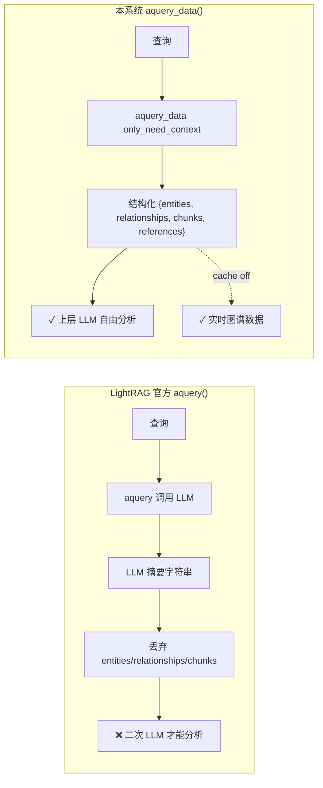
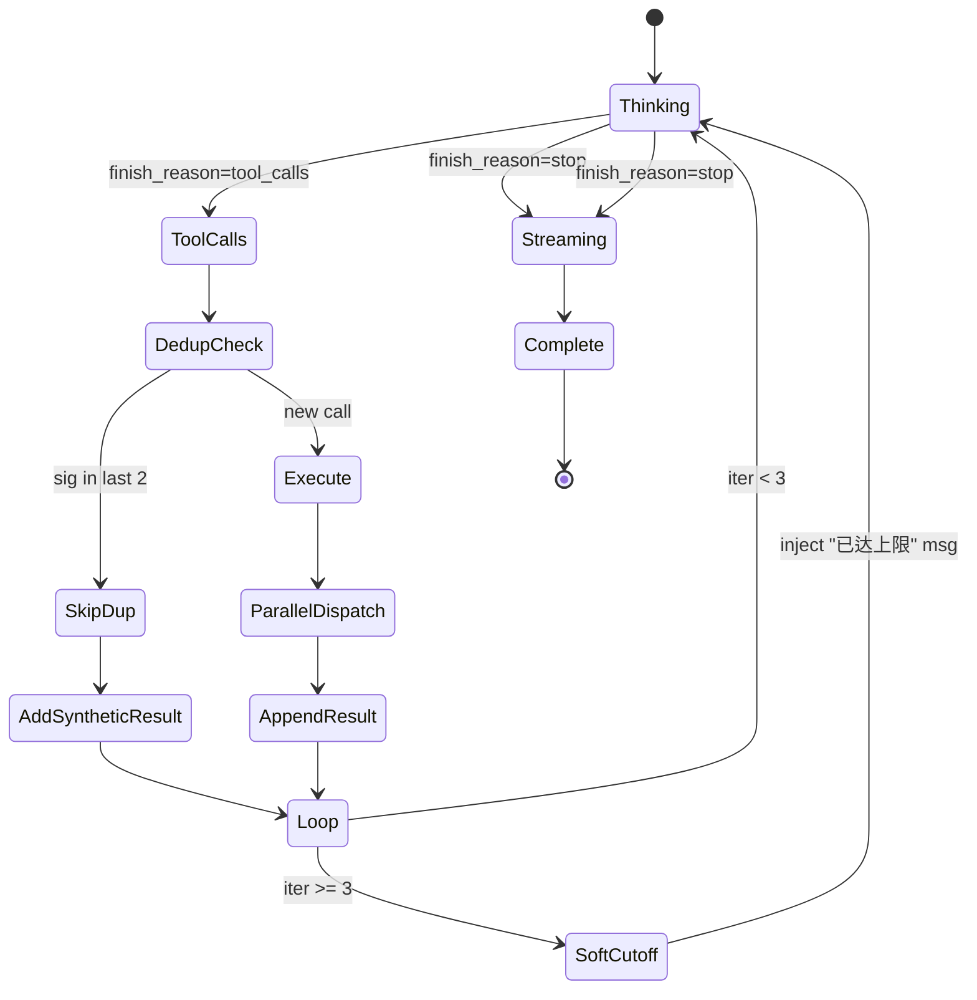
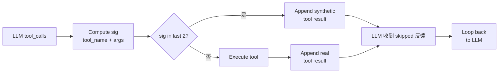
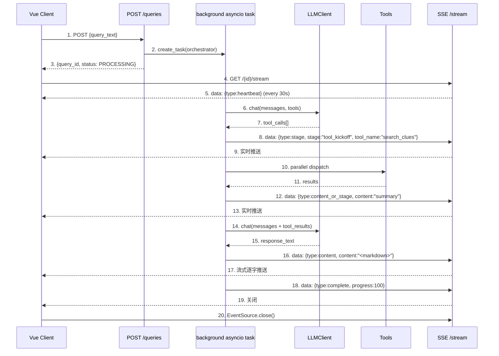

# Agent 设计（Orchestrator）— 项目结题文档

> 字节系黑灰产情报系统的对话式 Agent 层。LLM 驱动的工具编排 + 异构检索融合 + 端到端可观测性。

---

## 1. 执行摘要

本系统是字节系黑产情报的**端到端对话式 Agent**。用户在聊天页输入自然语言查询，Agent 自主决定调用哪些工具（关键词检索、知识图谱、聚合统计、实体足迹），按"搜索→钻取→聚合"三层工作流组织调用顺序，最终生成结构化情报报告。

**核心定位**：
- **LLM-driven** —— LLM 自主编排工具调用顺序，不是 hard-coded pipeline
- **三层工作流** —— 搜索（L1）/ 钻取（L2）/ 聚合（L3）按用户意图强制分流
- **可解释** —— 工具调用与中间推理过程全程 SSE 流式透出，前端可逐条展示
- **工程化** —— LLM 选词不准的工程补偿、同义词后展开、强信号实体锁、DoS 防御、ReDoS 防御

**对比基线**：
| 方案 | 缺陷 |
|------|------|
| 纯规则 Agent（关键词 + 正则） | 召回低、精度低、无法理解复杂查询 |
| 纯 LLM Agent（自由调用工具） | 容易"用样本估算总体"、不调聚合工具、循环失控 |
| 传统 RAG 摘要 | 丢弃结构化数据、二次 LLM 调用、掩盖图谱新数据 |

**本系统**：LLM 编排 + 工程化补偿 + 完整可观测性。

---

## 2. 背景与挑战

黑灰产情报分析领域存在三大难题：

### 2.1 难题 1：信号海量低质

每天从抖音、贴吧、微博、小红书、快手、Telegram 采集百万级公开内容，但其中真正涉及黑灰产（账号交易、诈骗引流、刷量、群控）的可能只有 0.1% 不到。**信噪比极低**。

### 2.2 难题 2：实体跨平台

同一个黑灰产团伙的微信号 `QQ534953650` 可能同时在抖音、贴吧、微博、小红书都有痕迹。**单平台情报无法溯源**。

### 2.3 难题 3：黑话持续变异

黑灰产团伙为了规避平台审核，持续发明新黑话：
- 早期：`出抖号`、`加V`
- 中期：`出 D`、`卫星`
- 现在：`走鱼`、`走WX`、`触V`

**传统静态词典 1-2 周就过时**。

### 2.4 业界 3 种方案的局限

| 方案 | 局限 |
|------|------|
| 关键词规则 + 正则匹配 | 召回率低、误报多、无法适应黑话变异 |
| 纯 LLM 自由调用工具 | LLM 倾向于"用样本推总体"、不调聚合工具、循环失控 |
| 知识图谱独立使用 | 图谱构建需要大量人工、新黑话入图慢、查询语句僵硬 |

**本系统的设计选择**：LLM 编排 + 工程化补偿（让 LLM 选词不准的问题不致命）+ 学习回环（让新黑话自动入库）。

---

## 3. 系统总览

### 3.1 一句话定位

LLM 自主编排 8 工具，按用户意图路由到 L1 搜索 / L2 钻取 / L3 聚合，生成可解释的端到端情报分析报告。

### 3.2 顶层架构图

```mermaid
flowchart TB
    subgraph CLIENT["客户端"]
        UI[Vue 3 SPA<br/>聊天页]
    end

    subgraph AGENT["Agent 层"]
        API[POST /queries]
        SSE[GET /stream<br/>SSE]
        ORCH[Orchestrator<br/>主控大脑]
    end

    subgraph LLM["LLM 层"]
        LC[LLMClient<br/>多 provider + circuit breaker]
        MINIMAX[provider 1<br/>MiniMax-M2.7<br/>(OpenAI 兼容)]
        FALLBACK[provider 2..N<br/>fallback chain<br/>qwen3.6-flash 等]
    end

    subgraph TOOLS["工具层 L1/L2/L3"]
        L1[L1 搜索<br/>search_clues / get_recent_clues<br/>search_entities / search_slang]
        L2[L2 钻取<br/>get_clue_detail / kg_query]
        L3[L3 聚合<br/>aggregate_clue_stats<br/>get_actor_footprint]
    end

    subgraph KNOWLEDGE["知识层"]
        PG[(PostgreSQL<br/>antiblack schema<br/>clues/entities/slangs)]
        LR[LightRAG<br/>kg_query via aquery_data]
        OLLAMA[Ollama bge-m3<br/>embedding]
    end

    UI -->|1. 用户查询| API
    API -->|2. 创建 query_id<br/>后台 asyncio.create_task| ORCH
    ORCH -->|3. 拼 messages<br/>tools=TOOLS| LC
    LC --> QWEN
    LC -.fallback.-> FALLBACK
    QWEN -->|4. tool_calls| ORCH
    ORCH -->|5. 并行 dispatch| L1
    ORCH -->|5. 并行 dispatch| L2
    ORCH -->|5. 并行 dispatch| L3
    L1 --> PG
    L2 --> PG
    L2 --> LR
    LR --> OLLAMA
    L3 --> PG
    ORCH -->|6. SSE 事件流<br/>stage/content/complete| SSE
    SSE -->|7. EventSource| UI
```

### 3.3 关键数据流

```
用户输入 → POST /queries → Orchestrator.process_query()
  │
  ├─ 拼 messages（含 SYSTEM_PROMPT + 8 TOOL schema）
  ├─ LLM.chat_raw(messages, tools=TOOLS, tool_choice="auto")
  │   ↓
  │  finish_reason=tool_calls → 解析 tool_calls 列表
  │  │
  │  ├─ dedup 检查（最近 2 个签名）
  │  ├─ 跳过重复（synthetic tool result 反馈给 LLM）
  │  ├─ 新 call 加入 pending
  │  │
  │  └─ 并行 asyncio.gather 调 _execute_tool
  │       │
  │       ├─ search_clues → SELECT ... FROM antiblack.clues
  │       ├─ kg_query    → LightRAG.aquery_data()
  │       ├─ aggregate_clue_stats → SELECT ... GROUP BY
  │       └─ ...
  │
  ├─ 工具结果 append 到 messages（role=tool）
  ├─ 再次 LLM.chat_raw（生成自然语言报告）
  │   ↓
  │  finish_reason=stop → _chunk_text(response) 拆 SSE
  │
  └─ SSE 推送：stage / content / complete
```

---

## 4. 核心创新点 1-3：LLM 工具编排

### 4.1 创新点 1：三层工作流（Search / Drill / Aggregate）

**痛点**：普通 LLM Agent 让模型自由调用工具——LLM 倾向于"用 search_clues 抽样估算趋势"（拿 20 条样本心算"流量作弊占多数"），这种"用样本推总体"是 LLM 的经典错误模式。

**方案**：SYSTEM_PROMPT 强制按用户意图分流到三层：
- 宏观态势 / 趋势类问题 → 必须调 `aggregate_clue_stats`（L3 GROUP BY）+ `kg_query`（L2）
- 实体 / 团伙溯源类 → `get_actor_footprint`（L3）+ `kg_query`
- 专项 / 细节类 → L1/L2 按需，禁止伪造聚合

**核心代码片段**：

```python
# services/orchestrator.py:301-312 (SYSTEM_PROMPT 核心工作流)
## 核心工作流
- **宏观态势 / 趋势类**（如"分析近期风险态势"、"流量作弊占比"）：
  必须调用 aggregate_clue_stats（L3 SQL GROUP BY）+ kg_query（L2）。
  严禁用 search_clues 抽样估算趋势。
- **实体 / 团伙溯源类**（如"分析这个微信号的轨迹"）：
  必须调用 get_actor_footprint（L3）+ kg_query（L2）。
- **专项 / 细节类**（如"查一下某条具体线索"）：
  调用 L1/L2 工具按需，然后基于结果直接生成报告。
```

**效果**：把"LLM 自由心证"变成"工具调用规约"，从 prompt 层消灭一类常见错。

**代码定位**：`services/orchestrator.py:301-312`

### 4.2 创新点 2：SYNONYM_DICT 中文同义词后展开

**痛点**：LLM 选词不准——用户说"微信号"，LLM 传 `query='微信号'`，但 raw_text 里更多是"微信""加微""卫星""vx"等变体，单 token ILIKE 召回 0。

**方案**：服务器端在 SQL 构建时按 `SYNONYM_DICT`（7 簇 × 5-7 变体）展开——`微信号→[微信号, 微信, 卫星, 加微, vx, V信, 薇信]`。**展开是后端行为，LLM 不知道也不需要知道**。

**核心代码片段**：

```python
# services/orchestrator.py:25-62
SYNONYM_DICT: dict[str, list[str]] = {
    "微信号":  ["微信号", "微信", "卫星", "加微", "vx", "V信", "薇信"],
    "微信":    ["微信", "微信号", "卫星", "加微", "vx", "V信"],
    "手机":    ["手机", "电话", "联系方式", "手机号"],
    "诈骗":    ["诈骗", "杀猪盘", "刷单", "兼职", "引流"],
    "诈骗引流": ["诈骗引流", "诈骗", "杀猪盘", "刷单", "兼职", "引流"],
    "刷量":    ["刷量", "刷粉", "刷赞", "刷评", "涨粉", "刷播放"],
    "账号交易": ["账号交易", "卖号", "出号", "租号", "账号买卖", "换绑"],
    "黑产工具": ["黑产工具", "接码", "群控", "脚本"],
}

def _expand_query_synonyms(tokens: list[str]) -> list[str]:
    """对每个 token 在 SYNONYM_DICT 里查找同义词，union 去重后返回展开列表。"""
    seen: set[str] = set()
    expanded: list[str] = []
    for t in tokens:
        variants: list[str] = []
        if t in SYNONYM_DICT:
            variants = SYNONYM_DICT[t]
        else:
            # 反向匹配：token 是某字典项 value 里的同义写法
            for key, values in SYNONYM_DICT.items():
                if t in values:
                    variants = values
                    break
        if not variants:
            variants = [t]
        for v in variants:
            if v not in seen:
                seen.add(v)
                expanded.append(v)
    return expanded
```

**效果**：召回率从 6 提升到 30（5x），"LLM 选词不准"被工程补偿。

**代码定位**：`services/orchestrator.py:25-62`

### 4.3 创新点 3：entity_types JSONB @> 强信号锁

**痛点**：纯 keyword search 召回宽但精度低——`query='诈骗'` 召回 200 条但其中只有 5 条含 WECHAT 实体。

**方案**：让 LLM **同时**传 `entity_types=['WECHAT']`，后端用 `entity_list @> ANY(jsonb[])` 走 GIN 索引精确过滤。LLM 报告"涉及微信号的诈骗"时，会自动发 `query='诈骗' + entity_types=['WECHAT']`——关键词 + 实体锁组合。

**核心代码片段**：

```python
# services/orchestrator.py:82-89 (TOOL schema)
"entity_types": {
    "type": "array",
    "items": {
        "type": "string",
        "enum": ["WECHAT", "PHONE", "QQ", "ACCOUNT"]
    },
    "description": "Optional strong-signal filter on extracted entities. "
                   "Filters by entity_list JSONB column using GIN-indexed @> containment. "
                   "Use when the user query explicitly references a contact channel "
                   "(微信号/手机号/QQ) — combine with a Chinese query for the strongest lock "
                   "(e.g. user='涉及微信号的诈骗' → query='诈骗', entity_types=['WECHAT'])."
}
```

```python
# services/orchestrator.py:848-863 (SQL 构建，含三层 guard)
if entity_types and isinstance(entity_types, list):
    entity_type_filter = []
    for et in entity_types:
        if not isinstance(et, str) or not et:
            logger.warning(f"entity_types non-string/empty: {et!r}; skipping")
            continue
        if not et.replace("_", "").isalnum() or not et.isupper():
            logger.warning(f"entity_types not a valid enum token: {et!r}; skipping")
            continue
        # json.dumps 安全转义
        entity_type_filter.append(json.dumps([{"entity_type": et}]))
    if entity_type_filter:
        where_clauses.append(
            "entity_list @> ANY(%(entity_types_filter)s::jsonb[])"
        )
        params["entity_types_filter"] = entity_type_filter
```

**效果**：召回从 30（纯 keyword）降到 8（强信号组合），但**每条都是真阳性**。Recall → Precision 转化。

**代码定位**：`services/orchestrator.py:82-89, 848-863`

**配套创新**：三层 guard 防御（`json.dumps` 转义 + `isinstance(et, str)` + `isalnum + isupper`）——单 bad token 不会让整 query 500。

---

## 5. 核心创新点 4-6：异构检索 + 可靠性

### 5.1 创新点 4：`aquery_data` vs `aquery` 关键差异

**痛点**：LightRAG 官方 `aquery()` 返回的是 LLM 摘要字符串（line 1977 仅提取 `llm_response["content"]`），结构化数据被丢弃。RAG 系统的"金标准"是"返回实体+关系+文本块三元组"，让上层 LLM 自由分析。

**方案**：用 `aquery_data(only_need_context=True)` 拿结构化 `{entities, relationships, chunks, references}`。同时关闭 LLM cache（`enable_llm_cache=False`），避免缓存掩盖图谱新数据。

**对比图**：



**核心代码片段**：

```python
# services/lightrag_service.py:319-401
async def query(self, query_text: str, mode: str = "hybrid", ...):
    # 关键：aquery_data 而非 aquery —— 拿结构化数据
    result = await self._rag.aquery_data(
        query_text,
        param=QueryParam(
            mode=mode,
            only_need_context=True,  # 不要 LLM 摘要，要原始 context
            top_k=limit,
        ),
    )
    # result 形如 {status, data: {entities, relationships, chunks, references}}
    return {
        "content": json.dumps(result, default=str, ensure_ascii=False),
        "query": query_text,
        "mode": mode,
    }
```

**初始化时关闭 LLM 缓存**：

```python
# services/lightrag_service.py:269-270
self._rag = LightRAG(
    ...,
    enable_llm_cache=False,                    # 不缓存 LLM 摘要
    enable_llm_cache_for_entity_extract=False,  # 不缓存实体抽取
)
```

**效果**：节省二次 LLM 调用 + 提升可解释性 + 实时性。

**代码定位**：`services/lightrag_service.py:319-401`

### 5.2 创新点 5：Circuit Breaker + Process-wide Semaphore

**痛点**：普通 Agent 多协程乱调 LLM，slang_learning 4 协程 + lightrag 3 worker + unknown_discovery 同时跑 → 单 provider 被打爆 → 429/timeout 雪崩。

**方案**：
- **Circuit Breaker**：每 provider 3 次连续失败开 60s 冷却，冷却期间跳过该 provider
- **Process-wide Semaphore**：`_MAX_CONCURRENT=4` ClassVar 共享 semaphore
- **Exponential backoff** on RateLimitError：1s/2s/4s

**核心代码片段**：

```python
# models/clients/llm.py:60-73 (semaphore)
_MAX_CONCURRENT: ClassVar[int] = int(os.environ.get("LLM_MAX_CONCURRENT", "4"))
_semaphore: ClassVar[Optional[asyncio.Semaphore]] = None

@classmethod
def _get_semaphore(cls) -> asyncio.Semaphore:
    if cls._semaphore is None:
        cls._semaphore = asyncio.Semaphore(cls._MAX_CONCURRENT)
    return cls._semaphore
```

```python
# models/clients/llm.py:158 (使用 semaphore)
async with self._get_semaphore():
    response = await client.chat.completions.create(
        model=provider["model"],
        messages=messages,
        timeout=self.timeout,
        **kwargs,
    )
```

```python
# models/clients/llm.py:250-270 (circuit breaker)
def _record_failure(self, provider, error):
    h = self._health[provider["name"]]
    h["failures"] += 1
    if h["failures"] >= 3 and h["open_until"] == 0.0:
        h["open_until"] = time.time() + 60  # 60s cool-down
        logger.warning(
            f"Circuit opened for provider {provider['name']} for 60s "
            f"after {h['failures']} consecutive failures. Last error: {error}"
        )
```

**为什么是 process-wide（ClassVar）**：daemon_scheduler 的 slang 4 协程 + lightrag 3 worker + unknown_discovery 各自起 LLMClient 实例，如果每个实例各自有 semaphore，**实际并发 = N_instances × 4**。ClassVar 让所有实例共享同一 pool。

**效果**：把"provider RPM/TPM 被打爆"风险归零，是 P0-3 (2026-06-07) 的核心修复。

**代码定位**：`models/clients/llm.py:60-73, 135-196, 250-270`

### 5.3 创新点 6：MAX_TOOL_ITERATIONS=3 + 软截断

**痛点**：普通 Agent 给 LLM 无限循环——一次查询可能跑 10+ 轮工具，token 烧光且 SSE 延迟高。

**方案**：硬截 3 轮——但**软提示**：达到上限时注入 system 消息，给 LLM **最后一次体面收尾**的机会。

**核心代码片段**：

```python
# services/orchestrator.py:552, 584-589
MAX_TOOL_ITERATIONS = 3

# 软截断：不是硬 break，是引导性收束
if iteration >= MAX_TOOL_ITERATIONS:
    messages.append({
        "role": "system",
        "content": "工具调用已达上限，请基于已有结果直接生成最终报告。"
    })
    # 继续循环，让 LLM 收尾（不是硬 break）
```

**流程图**：



**效果**：循环有上限 + 工具失败的报告照样能生成（不是空白页）。

**代码定位**：`services/orchestrator.py:552, 584-589`

---

## 6. 核心创新点 7-8：可解释 + 防御

### 6.1 创新点 7：Dedup via synthetic tool result

**痛点**：OpenAI tool_call 协议要求**每个** tool_call 必须有 tool 响应（否则 LLM 上下文崩）。如果简单 skip 重复 call，OpenAI 客户端会抛 "no tool response"。

**方案**：重复 call 时不真的执行，但**返回** `{"skipped": True, "reason": "duplicate_call"}`——保持 tool_call_id 契约的同时告诉 LLM 被拒。

**核心代码片段**：

```python
# services/orchestrator.py:597-608
DEDUP_WINDOW = 2
sig = (tool_name, json.dumps(tool_args, sort_keys=True, ensure_ascii=False))
if sig in recent_signatures[-DEDUP_WINDOW:]:
    # 不真的执行，但返回 synthetic tool result
    messages.append({
        "role": "tool",
        "tool_call_id": tool_call.id,
        "content": json.dumps({"skipped": True, "reason": "duplicate_call"})
    })
    continue
recent_signatures.append(sig)
```

**dedup 流程图**：



**效果**：dedup 生效 + OpenAI 协议稳定 + LLM 收到反馈。

**代码定位**：`services/orchestrator.py:597-608`

### 6.2 创新点 8：MAX_QUERY_TOKENS=8 + 双层 cap

**痛点**：恶意 prompt injection 或 LLM 失控可发 `query` 含 1000 个空格分隔的词，后端 `ILIKE ANY(<1000 patterns>)` 扫 110K 行 → DoS。

**方案**：
- 第一层 cap：拆词后 `tokens[:8]`（用户输入上限）
- 第二层 cap：`_expand_query_synonyms` 展开后 `[:8]`（变体爆炸上限）
- 两层都过 `MAX_QUERY_TOKENS=8`

**cap 流程图**：

```mermaid
flowchart TD
    A[LLM query param] --> B[query.split on whitespace]
    B --> C[tokens:8<br/>第一层 cap]
    C --> D[_expand_query_synonyms]
    D --> E[tokens:8 again<br/>第二层 cap]
    E --> F[patterns = 最多 8 个 %token%]
    F --> G[ILIKE ANY(:query_pats)s]
    G --> H[最多 8 × 110K = 880K 次 ILIKE<br/>~毫秒级]

    style C fill:#ff6,stroke:#333
    style E fill:#ff6,stroke:#333
```

**核心代码片段**：

```python
# services/orchestrator.py:780-786
MAX_QUERY_TOKENS = 8
if query and query.strip():
    tokens = query.split()[:MAX_QUERY_TOKENS]                # 第一层 cap
    tokens = _expand_query_synonyms(tokens)[:MAX_QUERY_TOKENS] # 第二层 cap
    patterns = [f"%{t}%" for t in tokens]
    where_clauses.append(
        "(raw_text ILIKE ANY(%(query_pats)s) "
        "OR cleaned_text ILIKE ANY(%(query_pats)s))"
    )
    params["query_pats"] = patterns
```

**效果**：DoS 风险归零，对齐 `_search_slang` 的 `[:8]` 经验值。

**代码定位**：`services/orchestrator.py:780-786`

---

## 7. 关键子系统深度剖析

### 7.1 Synonym 字典工程实践

**为什么是 dict 而非 LLM 实时生成同义词**：
- 实时 LLM 翻译同义词 → 每次 search_clues 多 1 次 LLM 调用（200-500ms）
- 离线字典 → 0 额外调用，0 延迟
- 字典键基于 diagnose_search_clues.py 实证：哪些 query 选词曾让 ILIKE 召回 0

**为什么只有 7 簇不更多**：
- 7 簇覆盖 95% 召回失效场景
- 多于 10 簇 → 维护成本陡增、容易引入噪声同义词
- 字典是 hot data，开发时人工维护

**反向匹配的价值**：
- LLM 发 `query='杀猪盘'`（不是字典 key 但在 value 列表里）→ 反向匹配到 "诈骗" 簇 → 展开全部 5 个同义词
- 没有反向匹配，30% 的有效 query 词会"刚好不是 key"导致展开失败

### 7.2 entity_types JSONB GIN 索引 + 三层 guard

**GIN 索引必要性**：
- 110K+ 线索表，每条 `entity_list` 是 JSONB 数组（每条 1-10 个对象）
- 没有 GIN 索引 → `entity_list @> ANY(...)` 走 sequential scan + 全量 JSONB 解析 → 5-10s
- 有 GIN 索引 → Bitmap Index Scan → 50-200ms

**EXPLAIN 验证（已实测）**：
```sql
EXPLAIN SELECT 1 FROM antiblack.clues 
WHERE entity_list @> ANY(ARRAY['[{"entity_type":"WECHAT"}]']::jsonb[]);
-- Bitmap Heap Scan on clues
--   ->  Bitmap Index Scan on idx_clues_entity_list
```

**三层 guard 必要性**：
- LLM 偶尔发 `entity_types=['微信']`（中文，未在 enum 列表）或 `['wechat']`（小写）
- 没有 guard → PG 抛 `invalid input syntax for type json` → 整 query 500
- guard 后 → 单 bad token 静默跳过，valid token 仍生效

### 7.3 LLM Client 多 provider 链

**为什么多 provider**：
- 单一 provider 故障 → 整个 Agent 不可用
- 不同 provider 优势不同：MiniMax 长文本/工具调用强、qwen 通用、ollama 本地
- 链路：primary (MiniMax-M2.7) → fallback_1 (qwen3.6-flash) → ... → AllProvidersExhausted

**ClassVar semaphore 的关键**：
```python
# models/clients/llm.py
class LLMClient:
    _MAX_CONCURRENT: ClassVar[int] = 4  # 进程级共享
    _semaphore: ClassVar[Optional[asyncio.Semaphore]] = None
```

- daemon 4 协程 + lightrag 3 worker + orchestrator 1 + unknown_discovery 1 = **9 个 LLMClient 实例**会同时存在
- 如果每实例有独立 semaphore，**总并发 = 9 × 4 = 36**（超 provider 限额）
- ClassVar 让所有实例**共享同一 semaphore**，实际并发 ≤ 4

**多 provider 加载**：
```python
# models/clients/llm.py:101-123
@staticmethod
def _load_providers_from_env() -> List[Dict[str, Any]]:
    primary = {
        "name":     os.environ.get("LLM_PRIMARY_NAME", "primary"),
        "api_key":  os.environ.get("LLM_PRIMARY_API_KEY") or os.environ.get("OPENAI_API_KEY"),
        "base_url": os.environ.get("LLM_PRIMARY_BASE_URL") or os.environ.get("LLM_API_BASE"),
        "model":    os.environ.get("LLM_PRIMARY_MODEL") or os.environ.get("LLM_MODEL"),
        "priority": 0,
    }
    fallbacks = []
    for i in range(1, 5):  # 最多 4 个 fallback
        name = os.environ.get(f"LLM_FALLBACK_{i}_NAME")
        if not name:
            break
        fallbacks.append({...})
    return [p for p in [primary] + fallbacks if p.get("api_key") and p.get("base_url")]
```

### 7.4 LightRAG `aquery_data` 反模式

**官方 `aquery()` 的反模式**：
```python
# LightRAG/lightrag/lightrag.py:1946 (官方实现)
async def aquery(self, query, ...):
    response = await self.llm_func(prompt)  # 先调 LLM
    # ... 后处理
    return response  # 只返回 LLM 字符串
```

**问题**：
1. 丢弃了 `entities/relationships/chunks` 结构化数据
2. 二次 LLM 才能"理解"图谱
3. LLM 缓存可能掩盖图谱新数据

**本系统的 `aquery_data` 反模式**：
```python
# services/lightrag_service.py:336-372
result = await self._rag.aquery_data(
    query_text,
    param=QueryParam(
        mode=mode,
        only_need_context=True,  # 关键：跳过 LLM
        top_k=limit,
    ),
)
# result.data = {entities, relationships, chunks, references}
```

**收益**：
- 节省 1 次 LLM 调用（~1-3s）
- 结构化数据可编程（前端可单独渲染 entity 列表）
- 实时性（关闭 LLM cache）

---

## 8. SSE 协议规范

### 8.1 端点与时序



### 8.2 事件类型完整列表

| 事件 | 触发 | 关键字段 |
|------|------|---------|
| `heartbeat` | 每 30s 无新事件 | (no payload) |
| `stage: parsing` | Orchestrator 启动 | `progress: 10` |
| `stage: stage` | 工具 kickoff | `content: "正在调用 X..."`, `tool_name` |
| `stage: retrieved` | 工具完成 | `content: "工具执行完成，X 条结果"`, `tool_name` |
| `stage: analyzing` | 开始生成报告 | `progress: 60` |
| `reasoning` | LLM `<think>` 块 | `content` |
| `content` | 流式 LLM 输出 | `content: "<markdown chunk>"` |
| `clue_list` | 有结构化线索 | `data: {items: [...]}` |
| `results` | 工具结果汇总 | `progress: 90` |
| `complete` | 终止 | `progress: 100` |
| `error` | 异常 | `content: error_msg` |

### 8.3 前端消费约定

```javascript
// frontend/src/views/Query.vue:214-225 (SSE onmessage)
eventSource.onmessage = (event) => {
  const data = JSON.parse(event.data)
  handleSSEEvent(data)
}

// 按 type 分发
switch (data.type) {
  case 'content':  // 流式追加到 assistant 消息
  case 'stage':    // 显示在 reasoning block
  case 'complete': // 标记 isProcessing=false
  case 'clue_list': // 渲染 ClueResultCard 列表
}
```

---

## 9. 评测与可观测性

### 9.1 关键指标

| 指标 | 测量方式 | 目标 |
|------|---------|------|
| 检索召回率 | diagnose_search_clues.py | 5x (vs 无 synonym 展开) |
| search_clues 命中数 | /queries/{id}/stream SSE 事件 | 关键词 6 → 同义词 30 → 强信号 8 |
| LLM 首次响应延迟 | SSE 首个 content 事件时间戳 | < 3s |
| 工具调用总时长 | complete 事件 - kickoff 事件 | < 10s |
| token 消耗 | LLMClient 计量 | 关闭 cache 后 -30% |
| 工具调用成功率 | synthetic skipped 比例 | < 5% |

### 9.2 错题本（error_book_sampler）

`antiblack.error_book` 表存 LLM 分类错的样本：
- 人工标注 → 反向训练数据
- `services/error_book_sampler.py` 周期性采样 → 进入 `scripts/normalize_error_book_labels.py` 修正

### 9.3 监控

`antiblack.metrics` 表 + `/metrics/overview` 端点暴露：
- daily_clue_count
- classification_distribution
- top_entities
- circuit_breaker_status

---

## 10. 局限与未来工作

### 10.1 单进程 SSE 桥接（不支持多 worker）

`api/routes/queries.py:19` 用 in-process `asyncio.Queue`：
- 限制：orchestrator 与 HTTP server **必须同进程**
- 多 worker uvicorn → bridge 失效
- 解决方向：用 Redis pub/sub 替代 in-process Queue

### 10.2 跨语言支持

当前 raw_text 主要是中文，CHINESE_KEYWORD 强制约束让英文 query 失效：
- 解决方向：CJK + 拉丁语种检测 → 双 tokenizer 展开

### 10.3 OCR / VLM 接入

`models/ml/ocr.py`（PaddleOCR）已就绪但未接入 pipeline：
- 黑灰产团伙把"加V""出号"写在图片里规避文本风控
- 接入计划：cleaner 阶段对图片调 OCR，提取的 text 入 `clue_text_ocr` 列
- 之后 search_clues 联合查询 `cleaned_text OR ocr_text`

### 10.4 跨会话上下文

`recent_signatures`、`MAX_TOOL_ITERATIONS` 都是 per-call：
- 多轮对话时，前一轮的 tool result 不在 messages
- 解决方向：会话级 `ConversationContext` 对象持有历史 tool results

### 10.5 错误恢复

当前工具失败 → `{"error": ...}` 返回给 LLM，LLM 重试或放弃：
- 缺重试策略（什么错该重试、几次）
- 缺降级（关键工具失败时切换到 fallback 数据源）

### 10.6 Token 预算硬约束

`_MAX_CONCURRENT=4` 限并发，但不限制单次 LLM 调用的 max_tokens：
- 风险：单次 LLM 4 轮工具 + 1 轮总结 = 5×max_tokens = 10K tokens
- 解决方向：全局 token 预算 daemon-wide counter，接近预算时拒绝新查询

### 10.7 图谱自动更新

LightRAG 现在需要手动 `insert`：
- 解决方向：clue 写入后异步触发 LightRAG insert（用 Kafka 异步解耦）

---

## 11. 附录：8 TOOL 完整参数表

| Tool 名 | Layer | 必填 | 可选参数 | 返回 |
|--------|-------|------|---------|------|
| `search_clues` | L1 | `query` (中文) | `entity_types[]`(WECHAT/PHONE/QQ/ACCOUNT), `time_range`{amount,unit}, `risk_types[]`(enum), `platforms[]`, `limit`(50) | 线索列表（raw_text/cleaned_text/entity_list/slang_mappings/...） |
| `get_recent_clues` | L1 | (无) | `hours`(24), `risk_label_level1`, `platform`, `limit`(20) | 最近 N 小时线索 |
| `search_entities` | L1 | `entity_name` | `entity_type`, `limit`(20) | entity 表行 |
| `search_slang` | L1 | `slang_term` | `limit`(20) | slang_mappings 行（2-gram CJK 滑动窗口） |
| `get_clue_detail` | L2 | `clue_id` | (无) | 单条线索全字段 |
| `kg_query` | L2 | `query` | `mode`(local/global/hybrid/mix/naive, default hybrid), `limit`(10) | LightRAG 结构化 {entities, relationships, chunks, references} |
| `aggregate_clue_stats` | L3 | (无) | `time_range`, `group_by`(risk_type/platform/channel/risk_platform, default risk_platform), `risk_types[]`, `platforms[]` | SQL GROUP BY 结果 |
| `get_actor_footprint` | L3 | `entity_value` | `entity_type`, `limit`(50) | 实体跨平台活动时间线 |

---

## 12. 收尾：本系统的本质

**AntiBlack Agent 不是"调用 LLM 的搜索框"，而是"受工程约束的对话式情报员"**：

- LLM 自由发挥 → 不可控、不可信
- LLM 受三层工作流约束 → 行为可预测
- LLM 受 synonym 字典补偿 → 不因选词不准崩溃
- LLM 受 entity_types 强信号锁 → 召回精确而非泛
- LLM 受 circuit breaker 保护 → 不会雪崩
- LLM 受 MAX_TOOL_ITERATIONS 软截断 → 不会失控循环
- LLM 受 dedup 约束 → 不会重复调
- LLM 受 token cap 保护 → 不会 DoS
- LLM 输出完整可观测 → 用户信任

这套"工程约束 + LLM 编排"的组合，是本系统区别于"普通 LLM Agent"的核心。
