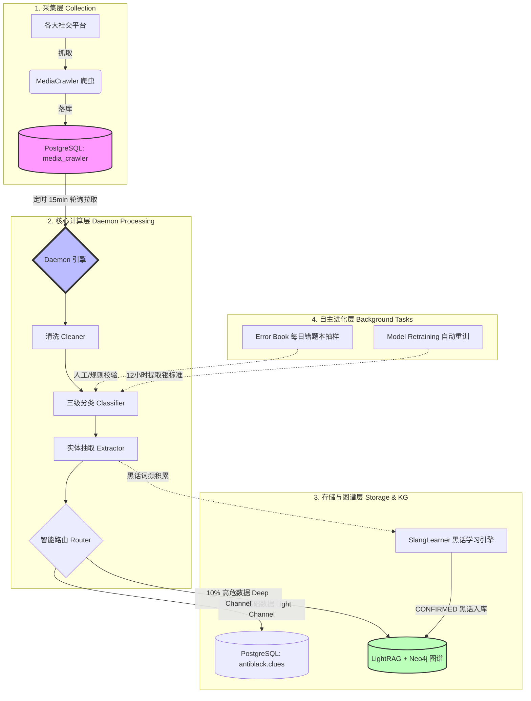
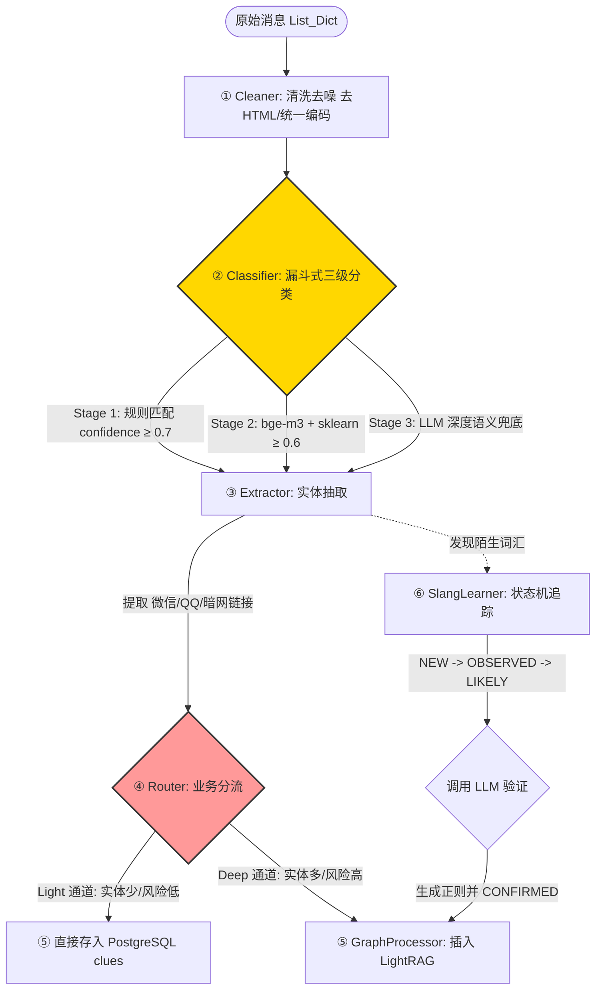
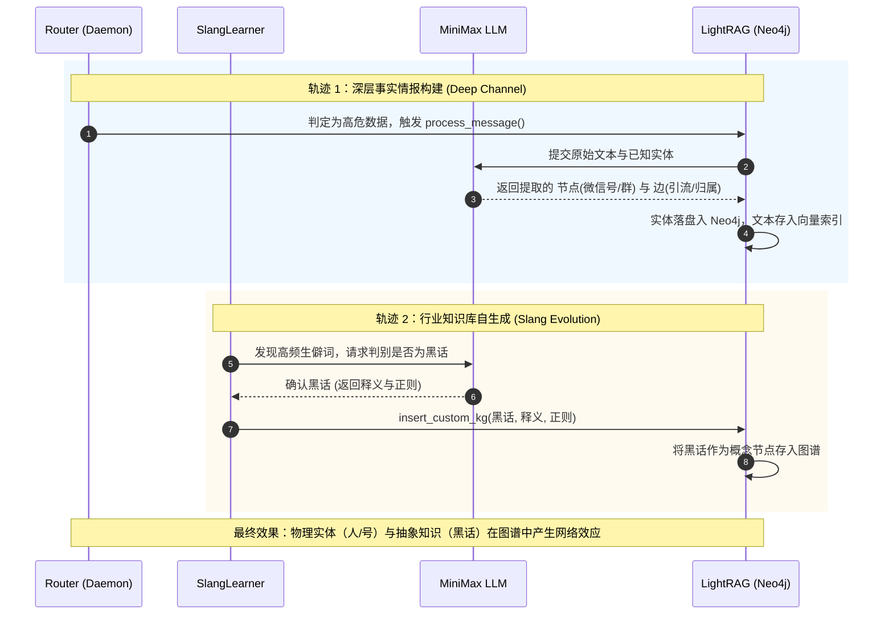

引入 Mermaid 图表来梳理这套架构是非常明智的选择。这套系统的数据流转包含了**漏斗过滤、多路分流、闭环反馈**等复杂逻辑，通过可视化的方式能更直观地看清它的“骨架”与“血脉”。

下面我将整个系统的完整生命周期拆解为三个核心视图，并为您进行全景讲解。

---

### 视图一：全局架构与数据流向 (The Big Picture)

首先，我们从宏观视角看看数据是如何从产生、被处理，最终沉淀为高价值情报的。

**💡 核心逻辑解读：**
整个系统采用了“解耦+漏斗”的思想。爬虫只管抓数据存入 DB，Daemon 引擎按照自己的节奏从 DB 拿数据。数据进入 Daemon 后，通过智能路由被分为两拨：普通线索进关系型数据库（轻便快捷），高危线索进图谱数据库（深度挖掘），互不干扰。同时，后台任务在悄悄地让整个系统自我升级。

---

### 视图二：核心处理引擎流水线 (The Processing Pipeline)

我们将上图中的“核心计算层 Daemon Processing”放大，看看单条数据在内存中经历了怎样的“大清洗”与“贴标签”过程。

**💡 核心逻辑解读：**

1. **降本增效的艺术 (Stage 1-3)：** 分类器没有盲目使用大模型。能用便宜且快速的规则（Stage 1）和小模型（Stage 2）解决的，绝不用 LLM（Stage 3）。只有极其狡猾的伪装文本，才会触发大模型调用。
2. **状态机驱动 (SlangLearner)：** 黑话不是一拍脑门决定的。一个新词必须在文本中被反复观测到（达到 LIKELY 状态），才会去惊动 LLM 进行终审，这极大地过滤了偶然产生的错别字噪音。

---

### 视图三：双轨图谱构建机制 (LightRAG Synergy)

这是系统中最具“黑科技”色彩的部分。LightRAG 作为底层图谱引擎，同时接收着来自两条独立业务线的“营养投喂”。

**💡 核心逻辑解读：**
LightRAG 在这里充当了连接“事实”**（嫌疑人的账号信息）和**“知识”（他们用的切口暗语）的桥梁。

* **轨迹 1** 让系统知道“谁在干坏事”。
* **轨迹 2** 让系统知道“干坏事的人都在用什么新暗语”。
当业务人员在前端通过 LightRAG 检索时，不仅能拔出萝卜带出泥地看到整个黑产团伙，还能看到这个团伙专属的“黑话词典”。

---

**系统闭环总结：**
这套架构最精妙的设计在于它的**生命力**。通过“数据收集 → 漏斗过滤 → LLM赋能 → 图谱编织”完成了第一层价值榨取；接着通过“模型重训 + 词库自动扩充”完成了自我迭代。它不仅是一个数据处理流水线，更是一个会自动进化的“风控安全专家”。

在实际落地这套系统或进行二次开发时，您目前最关注的是哪个环节的调优？是分类器（Classifier）漏斗的拦截准确率，还是 LightRAG 图谱中大模型抽取的并发性能？